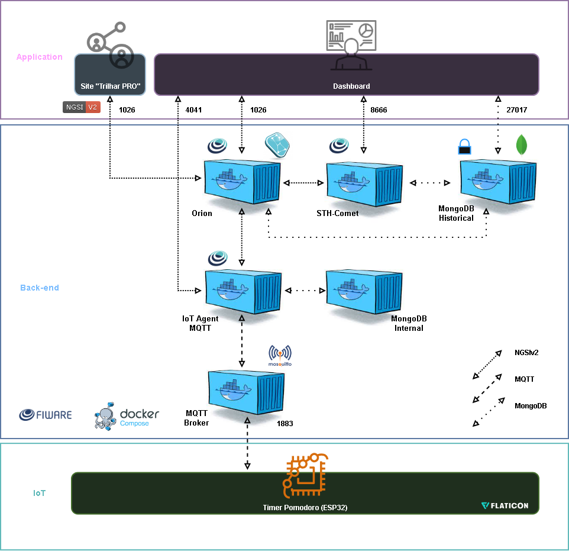

# 🚀 Global Solution: Plataforma "Trilhar" - Timer Pomodoro

> **Disciplina:** Edge Computing & Computer Systems  

> **Tema:** O Futuro do Trabalho - *Future at Work*

> **Projeto:** Monitor de Produtividade Inteligente (Pomodoro IoT)

🔗 **Vídeo explicativo no YouTube:** [Clique aqui para abrir]()

🔗 **Projeto no Wokwi:** [Clique aqui para abrir](https://wokwi.com/projects/447807652777145345)

---

## 📖 1. Descrição e Contexto do Projeto

### O Problema: O Desafio da Requalificação
No cenário do "Futuro do Trabalho", a requalificação profissional (*reskilling*) é mandatória. No entanto, estudar em casa ou em ambientes híbridos traz desafios de **disciplina, foco e ergonomia**. O trabalhador em transição muitas vezes perde a motivação ou não consegue gerenciar seu tempo de estudo eficiente.

### A Solução: Trilhar IoT
Este projeto é o módulo de hardware da plataforma **Trilhar** (nosso ecossistema de *reskilling*). Trata-se de um dispositivo **Timer Pomodoro Inteligente** conectado à nuvem.

Ele não é apenas um cronômetro; é um sistema de **Gêmeo Digital (Digital Twin)** que:
1.  **Gerencia o Tempo:** Implementa a técnica Pomodoro (ciclos de foco e descanso) diretamente no hardware.
2.  **Monitora a Presença:** Usa sensores para pausar o tempo automaticamente se o usuário sair da mesa ("Smart Pause").
3.  **Gamifica o Esforço:** Envia dados de ciclos completados para a nuvem, permitindo que a plataforma de software recompense o usuário.
4.  **É Bidirecional:** Pode ser controlado tanto fisicamente (botões) quanto remotamente (dashboard web).

---

## ⚙️ 2. Arquitetura da Solução

A solução "Trilhar" foi projetada seguindo uma arquitetura em três camadas robusta, baseada no padrão **FIWARE** para IoT e orquestração de dados. A estrutura garante escalabilidade, modularidade e separação clara de responsabilidades entre Hardware (Edge), Middleware (Cloud) e Aplicação (Frontend).



> *A imagem acima ilustra o fluxo de dados desde a borda até a aplicação.*

### 1. Camada IoT (Edge)
Esta é a camada física, responsável pela interação com o usuário e coleta de dados primários.

* **Timer Pomodoro (ESP32):** O dispositivo central da solução.
    * **Função:** Controla a lógica do timer (Foco/Pausa), lê os botões físicos (Start, Pause, Restart) e o sensor de presença.
    * **Comunicação:** Utiliza o protocolo **MQTT** (porta 1883) para publicar seu estado e receber comandos.
    * **Digital Twin:** Atua como a contraparte física da entidade virtual `urn:ngsi-ld:SessaoEstudo:001`.

### 2. Camada Back-end (Cloud / Middleware)
Hospedada em uma Máquina Virtual (VM) na Azure, esta camada processa, armazena e distribui os dados utilizando containers Docker do ecossistema FIWARE.

* **MQTT Broker (Eclipse Mosquitto):**
    * **Porta:** 1883
    * **Função:** O "carteiro" do sistema. Recebe as mensagens MQTT do ESP32 e as encaminha para o IoT Agent. Também entrega os comandos vindos do IoT Agent para o ESP32.
* **IoT Agent MQTT:**
    * **Porta:** 4041
    * **Função:** O "tradutor". Converte as mensagens MQTT (protocolo leve) vindas do dispositivo em requisições HTTP/NGSI-v2 (protocolo web) que o Orion entende, e vice-versa. Ele abstrai a complexidade do hardware para o restante do sistema.
* **Orion Context Broker:**
    * **Porta:** 1026
    * **Função:** O "cérebro". Gerencia o contexto atual da aplicação. Ele armazena o estado *presente* da entidade `SessaoEstudo` (ex: "está em foco", "tempo restante: 500s"). O Dashboard lê e escreve dados diretamente aqui.
* **STH-Comet (Short Time History):**
    * **Porta:** 8666
    * **Função:** O "historiador". Recebe notificações do Orion sempre que um ciclo é completado e armazena esses dados em séries temporais no banco de dados, permitindo a geração de gráficos históricos.
* **MongoDB (Internal & Historical):**
    * **Porta:** 27017
    * **Função:** Banco de dados NoSQL utilizado tanto pelo Orion (para guardar o estado atual) quanto pelo STH-Comet (para guardar o histórico).

### 3. Camada Application (Frontend)
A interface com o usuário final, focada na experiência e visualização de dados.

* **Site "Trilhar PRO" (Simulado):** Representa a integração futura com a plataforma principal de *reskilling*.
* **Dashboard (Streamlit):**
    * **Porta:** 8050
    * **Função:** Uma aplicação web interativa desenvolvida em Python.
        * **Comando:** Envia comandos de configuração (ex: "Definir 25 min") para o Orion via HTTP (PATCH).
        * **Monitoramento:** Consome dados em tempo real do Orion (GET) para mostrar o status e o timer.
        * **Analytics:** Consome dados históricos do STH-Comet (GET) para plotar o gráfico de sessões completadas.

---

### 🏗️ Diagrama de Camadas

| Camada | Componente | Tecnologia | Função Principal |
| :--- | :--- | :--- | :--- |
| **1. Edge (Hardware)** | **Dispositivo IoT** | ESP32 (C++) | Controlador da lógica, leitura de sensores, feedback sonoro. Comunica-se via **MQTT**. |
| **2. Backend (Cloud)** | **Middleware** | Azure VM + Docker | Hospeda o stack **FIWARE**. |
| | *Broker MQTT* | Mosquitto | Recebe mensagens do ESP32. |
| | *IoT Agent* | FIWARE IoT Agent | Traduz MQTT para NGSI v2 (HTTP). |
| | *Context Broker* | FIWARE Orion | O "Cérebro". Armazena o estado atual (Contexto). |
| | *Historiador* | FIWARE STH-Comet | O "Historiador". Armazena séries temporais para gráficos. |
| **3. Aplicação (Front)**| **Dashboard** | Python Streamlit | Interface do usuário. Envia comandos e visualiza dados em tempo real e histórico. |

---

## 🚀 3. Funcionalidades Implementadas

1.  **Timer Pomodoro Configurável:** Controle de tempo para Foco (15/25/50 min) e Descanso (3/5/10 min), ajustáveis remotamente.
2.  **Smart Pause (Pausa Inteligente):** Uso de **Sensor Ultrassônico** para detectar se o usuário saiu da mesa. Se ausente por >30s, o sistema pausa automaticamente.
3.  **Ciclo de Ouro (Regra de Negócio):** Implementação lógica onde a cada **4 ciclos curtos** completados, o sistema impõe uma **Pausa Longa** para descanso mental.
4.  **Gamificação:** Contagem persistente de "Ciclos Totais" enviados ao dashboard.
5.  **Feedback Multimodal:** Alertas sonoros (Buzzer) e visuais (Dashboard) sincronizados.

---

## 📂 4. Estrutura do Repositório

```bash
/
├── backend-dashboard/         
│ ├── dashboard.py                              # Código da Aplicação (Streamlit)
│ └── requirements.txt                          # Lista de dependências Python.
│
├── configuracao-postman/          
│ └── Pomodoro_FIWARE.postman_collection.json    # Collection do Postman para configurar a API.
│
├── dispositivo-iot/  
│ ├── diagram.json                              # Diagrama de conexões do simulador Wokwi        
│ └── esp32_trilhar.ino                         # Código do Firmware (ESP32/C++)
│
├── img/
│ ├── hardware pomodoro trilhar.png             # Print hardware.
│ ├── monitor serial trilhar.png                # Print do ESP32 enviando dados. 
│ ├── pomodoro trilhar.png                      # Print do dashboard funcional.
│ └── trilhar.drawio.png                        # Arquitetura da Solução
│
└── README.md                                   # Documentação do Projeto
```

---

## 🛠️ 5. Recursos e Materiais Utilizados

### Hardware (Simulado no Wokwi)
* **Microcontrolador:** ESP32 DevKit V1.
* **Entrada (Controle):** 3x Push Buttons (Start, Pause/Resume, Restart).
* **Entrada (Sensor):** 1x Sensor Ultrassônico HC-SR04 (Detecção de presença).
* **Saída (Feedback):** 1x Buzzer Piezoelétrico (Alertas sonoros).
* **Conectividade:** WiFi + Protocolo MQTT.

### Software & Dependências
* **Firmware:** Arduino Framework (C++).
    * Libs: `WiFi.h`, `PubSubClient.h`.
* **Backend:** Docker & Docker Compose.
    * Imagens: `fiware/orion`, `fiware/iotagent-ul`, `eclipse-mosquitto`, `telefonicaiot/fiware-sth-comet`, `mongo`.
* **Dashboard:** Python 3.10+.
    * Libs: `streamlit`, `requests`.

---

## 🔌 6. Estrutura e Montagem (Hardware)

O dispositivo deve ser montado conforme o diagrama abaixo (ou `diagram.json` no Wokwi).

**Pinagem do ESP32:**
* **GPIO 12:** Botão START (Verde)
* **GPIO 13:** Botão PAUSE (Amarelo)
* **GPIO 14:** Botão RESTART (Vermelho)
* **GPIO 15:** Buzzer (Positivo)
* **GPIO 26:** Sensor Trig (HC-SR04)
* **GPIO 25:** Sensor Echo (HC-SR04)

---

## 🚀 7. Manual de Instalação e Execução

Siga esta ordem rigorosamente para garantir a conexão de todos os componentes.

### Passo 1: Configuração da Nuvem (Backend)
1.  **Criar VM:** Inicie uma VM.
2. **Abrir Portas (Firewall):** No "Network Security Group" (NSG) da VM, crie regras de entrada para **Permitir (Allow)** tráfego **TCP** de **Qualquer (Any)** origem para as seguintes portas:
    * `22`   (SSH)
    * `1883` (MQTT)
    * `4041` (FIWARE IoT Agent)
    * `1026` (FIWARE Orion Broker)
    * `8666` (FIWARE STH-Comet)
    * `8050` (Dashboard Python)
3.  **Instalar Docker:** Conecte-se à VM via SSH e instale o Docker e o Docker Compose:
    ```bash
    sudo apt update
    sudo apt install docker.io
    sudo apt install docker-compose
    ```
4.  Acesse sua VM.
5. **Clonar FIWARE:** Na VM, clone o repositório ["FIWARE Descomplicado"](https://github.com/fabiocabrini/fiware):
    ```bash
    git clone https://github.com/fabiocabrini/fiware.git
    cd fiware
    ```
6.  Inicie os containers:
    ```bash
    sudo docker-compose up -d
    ```
7.  **Provisionamento (Postman):**
    * Configure o Postman para apontar para o IP da sua VM.
    * Crie o **Service Group** (IoT Agent).
    * Crie o **Device** (IoT Agent) mapeando os atributos (`st`, `sc`, `dc`, `tr`, `dpc`, `ppt`, `cct`) e comandos (`set_duracao`, `set_pausa`).
    * Crie a **Subscription** no Orion para notificar o STH-Comet sobre mudanças em `sessoes_completas`.

### Passo 2: Inicialização do Hardware (Edge)
1.  Abra o projeto no simulador [**Wokwi**](https://wokwi.com/projects/447807652777145345).
2.  No arquivo `sketch.ino`, edite a variável:
    ```cpp
    const char* MQTT_BROKER_IP = "SEU_IP_PUBLICO_DA_AZURE";
    ```
3.  **IMPORTANTE:** Inicie a simulação *antes* de abrir o dashboard.
4.  Aguarde o Monitor Serial exibir `Conectado ao MQTT Broker!`. Isso garante que a entidade foi criada no FIWARE.

### Passo 3: Inicialização da Aplicação (Frontend)
1.  No seu ambiente local (ou na VM), prepare o Python:
    ```bash
    python -m venv venv
    source venv/bin/activate # ou .\venv\Scripts\activate no Windows
    pip install streamlit requests
    ```
2.  No arquivo `dashboard.py`, configure o IP. Se rodar na mesma VM do Docker, use `localhost`. Se rodar no seu PC, use o IP público da VM.
    ```python
    IP_DA_SUA_VM = "localhost"
    ```
3.  Execute o dashboard:
    ```bash
    streamlit run dashboard.py --server.port 8050
    ```

---

## 🧠 8. Lógica do Sistema (Regras de Negócio)

O sistema implementa uma Máquina de Estados Finitos no ESP32:

1.  **OCIOSO:** Estado inicial. Aguarda configuração (via Dashboard) ou início (Botão START).
2.  **FOCO:** O timer decrementa. O Sensor de Presença está ativo.
    * *Regra Smart Pause:* Se o sensor detectar ausência (>50cm) por 30s, muda automaticamente para `PAUSA_FOCO`.
3.  **PAUSA_FOCO:** O tempo para. Aguarda o usuário retornar e apertar PAUSE para retomar.
4.  **FOCO_CONCLUIDO:** O tempo de foco acabou. O buzzer toca. O sistema incrementa o contador de sessões.
5.  **PAUSA_DESCANSO:** O tempo de descanso decrementa.
    * *Regra do Ciclo de Ouro:* A cada 4 sessões curtas completadas, o sistema impõe automaticamente uma **Pausa Longa** (ex: 20 min). Ao final dela, o contador de **Ciclos Totais** é incrementado.

---

## 📸 9. Resultados da PoC (Prova de Conceito)

### Dashboard Integrado
O dashboard exibe o estado em tempo real e permite configuração remota.


### Monitoramento Serial (Wokwi)
O console do ESP32 mostra o envio de telemetria MQTT e a recepção de comandos.


### Integração FIWARE (Postman)
Validação de que os dados estão persistidos no Orion.
```json
{
    "id": "urn:ngsi-ld:SessaoEstudo:001",
    "type": "SessaoEstudo",
    "TimeInstant": {
        "type": "DataTime",
        "value": "2025-11-19T00:41:51.1732",
        "metadata": {}
    },
    "ciclos_totais":{
        "type": "Number",
        "value": 0,
        "metadata": {
            "TimeInstant": {
                "type": "DataTime",
                "value": "2025-11-19T00:41:51.1732",
            }
        }
    },
    "duracao_configurada":{
        "type": "Number",
        "value": 15,
        "metadata": {
            "TimeInstant": {
                "type": "DataTime",
                "value": "2025-11-19T00:41:51.1732",
            }
        }
    },
    "duracao_pausa_configurada":{
        "type": "Number",
        "value": 3,
        "metadata": {
            "TimeInstant": {
                "type": "DataTime",
                "value": "2025-11-19T00:41:51.1732",
            }
        }
    },
    "proxima_pausa_tipo":{
        "type": "Text",
        "value": "curta",
        "metadata": {
            "TimeInstant": {
                "type": "DataTime",
                "value": "2025-11-19T00:41:51.1732",
            }
        }
    },
    "sessoes_completas":{
        "type": "Number",
        "value": 1,
        "metadata": {
            "TimeInstant": {
                "type": "DataTime",
                "value": "2025-11-19T00:41:51.1732",
            }
        }
    },
    "set_duracao_status":{
        "type": "commandStatus",
        "value": "PENDING",
        "metadata": {
            "TimeInstant": {
                "type": "DataTime",
                "value": "2025-11-19T00:41:51.1732",
            }
        }
    },
    "set_pausa_status":{
        "type": "commandStatus",
        "value": "PENDING",
        "metadata": {
            "TimeInstant": {
                "type": "DataTime",
                "value": "2025-11-19T00:41:51.1732",
            }
        }
    },
    "status_sessao":{
        "type": "Text",
        "value": "foco",
        "metadata": {
            "TimeInstant": {
                "type": "DataTime",
                "value": "2025-11-19T00:41:51.1732",
            }
        }
    },
    "tempo_restante_seg":{
        "type": "Number",
        "value": "891",
        "metadata": {
            "TimeInstant": {
                "type": "DataTime",
                "value": "2025-11-19T00:41:51.1732",
            }
        }
    },
    "set_duracao":{
        "type": "command",
        "value": "",
        "metadata": {}
    },
    "set_pausa":{
        "type": "command",
        "value": "",
        "metadata": {}
    }
}
```

---

## 🔒 10. Notas de Segurança

* O Firewall da Azure deve ser configurado para restringir o acesso às portas 1026, 4041 e 8666 apenas a IPs autorizados.

---

## 👥 11. Equipe de Desenvolvimento

* **Rodrigo Cardoso Tadeo** - RM: 562010
* **Vinicius Cavalcanti dos Reis** - RM: 562063

---

### 📄 12. Licença

Este projeto é livre para uso educacional. Para uso comercial, consulte os autores.